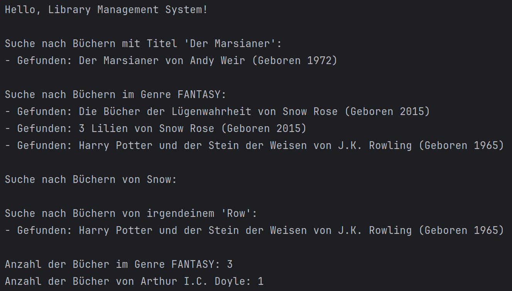

# Übung
**Datenverarbeitung**

Wir wollen eine Bibliothekssoftware schreiben, die Bücher verwaltet und Informationen über Genres und Autoren speichert.

---

---

# Quellcode

Verfügbar unter https://l.itsnameless.de/dvrepo

---

# Hinweise

> Verwende bei Klassen, Attributen, ... immer die *strengsten* Zugriffsmodifizierer, die für den aktuellen Use-Case notwendig sind!

> Damit ihr nicht alle Beispiele abtippen müsst, findet ihr im Repository die Datei `COPY.md` mit den vollständigen Daten zum kopieren.

---

# Aufgabe 1

> Um die Bibliotheksverwaltung zu schreiben, benötigen wir ein Java Projekt und Pakete.

---

### Grundlagen

1. Erstelle ein Java-Projekt mit dem Namen `datenverarbeitung-uebung` und einem Paket `library.management`.
2. Erstelle zwei Unterpakete:
    - `library.management.models`
    - `library.management.testing`
3. Erstelle eine Klasse `LibraryTest` mit `main`-Methode im Paket `library.management.testing` und füge eine Systemausgabe `Hello, Library Management System!` hinzu.
4. Teste die Funktionalität.

---

# Aufgabe 2

> Bücher gehören gewissen Genres an. Diese wollen wir mittels `Enum` nun verwalten können.

---

### Enums

1. Erstelle im Paket `models` ein Enum `Genre` mit den Attributen und entsprechendem Konstruktor und Gettern:

| Attribut      | Datentyp  | Erklärung                         |
| ------------- | --------- | --------------------------------- |
| `name`        | `String`  | deutscher Name                    |
| `description` | `String`  | Beschreibung des Genres           |
| `rating`      | `integer` | Wert von 1-5, wie Sternebewertung |

---

### Enums

2. Erstelle ein Paar Genres:

| Genre           | `longName`           | `description`                            | `rating` |
| --------------- | -------------------- | ---------------------------------------- | -------- |
| Non Fiction     | Sachbuch             | Bücher, die ...                          | 4        |
| Fantasy         | Fantasy              | Eine Erzählung, die ...                  | 5        |
| Science Fiction | Wissenschaftsfiktion | Zukunftsorientierte Geschichten, die ... | 4        |
| Mystery         | Krimi                | Erzählungen rund um...                   | 3        |

**Bonus**: Lass den Konstruktor einen Fehler werfen, wenn versucht wird, ein ungültiges Rating zu speichern.

---

# Aufgabe 3

> Bücher werden von Autoren geschrieben. Dafür benötigen wir ebenfalls einen Datensatz. Da wir nicht viel mit den Autoren machen wollen, nutzen wir `Record`.

---

### Records

1. Erstelle in `models` ein Record `Author` mit folgenden Attributen in der kürzesten Form, die wir gelernt haben:

| Attribut    | Datentyp  | Erklärung   |
| ----------- | --------- | ----------- |
| `surname`   | `String`  | Nachname    |
| `firstname` | `String`  | Vorname     |
| `birthYear` | `integer` | Geburtsjahr |
2. Überschreibe die `toString()` Methode, um eine einfache Darstellung von Vorname, Nachname und Geburtsjahr zu erhalten.

---

### Records

1. Erstelle in deiner `main()` Methode einige Autoren:

| `surname` | `firstname` | `birthYear` |
| --------- | ----------- | ----------- |
| Rowling   | J. K.       | 1965        |
| ...       | ...         | ...         |
| Weir      | Andy        | 1972        |

---
# Aufgabe 4

> Nun wollen wir Bücher erstellen! Dafür nutzen wir das Java Builder Pattern.

---

### Klassen

1. Erstelle in `models` eine Klasse `Book` mit folgenden Attributen und Gettern (aber zunächst **ohne** Konstruktor und Setter):

| Attribut | Datentyp | Erklärung        |
| -------- | -------- | ---------------- |
| `title`  | `String` | Titel des Buches |
| `author` | `Author` | Autor des Buches |
| `genre`  | `Genre`  | Genre des Buches |

---

### Builder Pattern

> Implementiere das Builder Pattern für unser Buch.

1. Erstelle einen innere statische Klasse `Builder` die die selben Attribute erhält, wie unser `Book`.
2. Erstelle die `set...` Funktionen, die:
    - im `Builder` das entsprechende Attribut setzen
    - `this` zurückgeben, um Aufrufe verketten zu können
3. Erstelle einen privaten Konstruktor für `Book`, der den `Builder` erhält und davon die entsprechenden Attribute setzt.
4. Erstelle im `Builder` die `build` Funktion, die eine neue Instanz von `Book` zurückgibt.

---

### Builder Pattern

5. Erstelle in der `main()`-Methode nun einige Bücher:

| `title`                      | `author`  | `genre`         |
| ---------------------------- | --------- | --------------- |
| Die Bücher der Lügenwahrheit | Rose Snow | Fantasy         |
| ...                          | ...       | ...             |
| Der Marsianer                | Andy Weir | Science Fiction |

---

# Aufgabe 5

> In unserem Universum gibt es viele verschiedene Bücher, manche mit Zahlen, manche mit Texten und manche einfach Wahr oder Falsch. Wir wollen all diese Inhalte aufnehmen können.

---

### Generics

1. Füge `Book` ein Attribut `content` hinzu, dass einen generischen Typ `T` nutzt, damit jeder mögliche Inhalt abgespeichert werden kann.
2. Füge dies nun auch im Builder hinzu.

---

### Generics

3. Füge nun einigen Büchern `content` hinzu:

| `title`                               | Datentyp    | `content`                           |
| ------------------------------------- | ----------- | ----------------------------------- |
| Die Bücher der Lügenwahrheit          | `String`    | `Der Landschaft Cornwalls ...`      |
| Harry Potter und der Stein der Weisen | `String`    | `Mr. und Mrs. Dursley, ...`         |
| Rechnerarchitektur                    | `Integer[]` | `0x45, 0x69, 0x6E, 0x20, 0x43, ...` |
| Der Marsianer                         | `String`    | `Ich bin sowas von im Arsch...`     |

---

# Aufgabe 6

> Nun wollen wir eine Bibliothek erstellen, mit welcher wir einfach Bücher verwalten und Suchen können.

---

### Bibliotheksklasse

1. Erstelle in `models` eine Klasse `Library`, die eine Liste von `Book` verwaltet.
    - Übergib dabei **einen** Type Parameter, damit alle Bücher einer Bibliothek den selben Datentyp haben müssen!
    - Die Bücher sollen als `List<Book<T>>` gespeichert werden, aber nicht direkt gesetzt werden!
2. Erstelle nun zwei Methoden, die einzelne Bücher zu der Liste hinzufügen und entfernen können.
    - Nenne sie `addBook` und `removeBook`.

---

### Bibliotheksklasse

1. Erstelle nun eine Bibliothek mit dem Content-Typ `String` in deiner `main()`-Methode und füge unsere Bücher hinzu!
    - Welches Buch kannst du nicht hinzufügen?

---

# Aufgabe 7

> Um die Bibliothek optimal zu verwalten, wollen wir nun verschiedene Suchoptionen implementieren und Bücher zählen können.

---

### Streams

1. Füge der `Library` eine neue Methode `findByTitle` hinzu, die
    - ein Argument `title` erhält
    - mittels `stream().filter()` die Bücher filtert, die den Suchbegriff im Titel beinhalten
    - eine Liste von `Book` zurückgibt.
    - **Bonus**: Mit welcher Methode kann der Titel nicht auf exakte Übereinstimmung, sondern auf Übereinstimmung ohne Groß- und Kleinschreibung überprüft werden?
2. Mache das selbe für die Suche nach:
    - Genres
    - Autor-Vornamen **UND** Autor-Nachnamen (übergib zwei Argumente, die dann stimmen müssen)
    - **Bonus**: Autor-Vornamen **ODER** Autor-Nachnamen, der teilweise enthalten ist (übergib ein Argument, der irgendwo enthalten sein muss)

---

### Streams

3. Füge eine neue Methode `countBooksByGenre` hinzu, die
    - ein Argument `Genre` erhält
    - die Bücher filtert
    - mittels `stream().count()` die Bücher zählt
    - ein `long` zurückgibt.
4. Mache das selbe für:
    - Autor-Vorname und Autor-Nachname

---

### Streams

5. Teste nun deine Methoden in `main()`, indem du:
    - alle Bücher ausgibst, die den Titel "Der Marsianer" haben
    - alle Bücher von "Rose Snow" ausgibst
    - die Anzahl der Bücher ausgibst, die zu "Fantasy" gehören
    - die Anzahl der Bücher ausgibst, die von "Arthur I. C. Doyle" stammen
6. Verwende `forEach` und Lambdas, um jedes Suchergebnis einzeln auszugeben
    - nutze dafür **immer** das Format `- Gefunden: <Titel> von <Autor>`
    - verwende für den Autor die `toString` Methode

---

# Aufgabe 8

> In dem `forEach` haben wir mehrfach den selben Lambda verwendet. Lasst uns doch ein Functional Interface nutzen!

---

### Functional Interfaces

1. Erstelle in `testing` ein funktionales Interface `ResultPrinter` mit einer Methode `showResult`:
    - nutze die entsprechende Annotation für das Interface
    - übergebe den Parameter `book` vom Typ `Book<T>`
    - achte darauf, den Typen-Parameter `T` am Interface hinzuzufügen!
2. Implementiere nun in `main` das Interface und ersetze das wiederholte Printen in den `forEach` Statements.

---

# Aufgabe 9

> Um das alles noch deutlich komplizierter zu machen, nutzen wir jetzt Reflections.

---

### Reflections

1. Erstelle in `testing` eine Klasse `Reflections` mit einer `main()`-Methode.
2. Nutze Reflections, um die `Class` von `Book` und `Author` zu finden.
3. Gib alle Felder (`fields`) von `Book` aus.
4. Gib die Modifier von `Author` aus.

---

# Feedback

Hat euch diese Stunde sehr gut gefallen? War sie absolut schrecklich? Das ist mir _nicht_ egal! Also lasst Feedback da!

https://l.itsnameless.de/practice

---

# Vielen Dank für eure Aufmerksamkeit!

https://social.itsnameless.de

